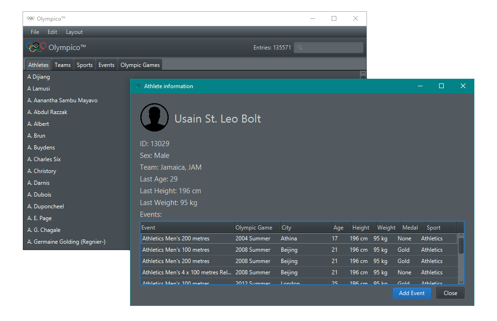
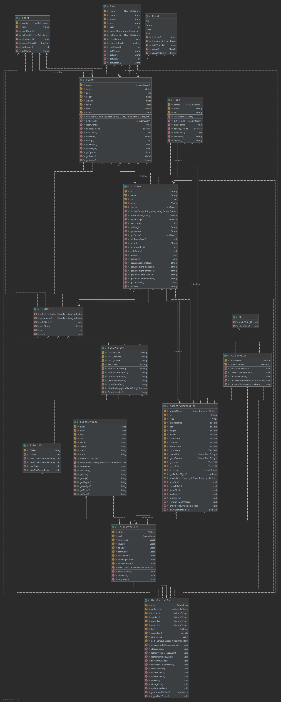

# Olympico™
The ultimate olympic games database tool.

Use with data from https://www.kaggle.com/heesoo37/120-years-of-olympic-history-athletes-and-results.

## Screenshot

## Author
7055197 - TINF19A - DHBW Stuttgart

## Special Features
#### Menu
- Start a new database: File -> New
- Open database files: File -> Open...
- Save currently open database file: File -> Save
- Save a copy of currently open database: File -> Save as...
- Exit application without saving: File -> Exit
- Add new athletes (with one event) to the database: Edit -> Add Athlete
- Toggle dark theme (enabled by default): Layout -> Dark Theme (source of css file: https://stackoverflow.com/questions/49159286/make-a-dark-mode-with-javafx)
- All open windows are toggled

#### Main
- Use tabs to switch between athletes, teams, sports, events and olympic games
- Use search bar on the top right to filter entries (Shows everything containing the search string e.g. "1980 Summer" can be found with "1980", "Summer", "80 Su" ...)
- When changing tabs or using the search, the amount of found entries gets refreshed
- While in "Athletes" tab, double clicking an entry shows more details about the athlete. Alternatively navigation with the up/down arrows and enter is possible.

#### Athlete information
- Shows basic information about the athlete
- Calculates last event and shows last age, last height and last weight
- All events in which the athlete was involved are displayed in a table
- By clicking "Add Event" the new entry window shows up with pre-inserted values of the athlete (Name, Sex, Team, Last age, Last height, Last weight)

#### Add entry
- Can be accessed in two ways
- Either shows blank fields to add a new athlete with one event.
- Or shows pre-filled fields to add an event to an existing athlete.
- There is no field for the id, because when adding events, it stays the same and when adding athletes it gets generated anyway. 

## Development

#### Versions
- OpenJDK 11.0.2
- JavaFX Windows SDK 11.0.2

#### Download and Extract Java FX
https://gluonhq.com/products/javafx/

#### Add Java FX to project
Add lib directory of javafx folder to project libraries

#### Edit Run configuration
VM-Options:
`--module-path [PATH_TO_JAVAFX_LIB_DIRECTORY] --add-modules=javafx.controls,javafx.fxml`

## UML Diagram
This file can be found in the root directory as well.

